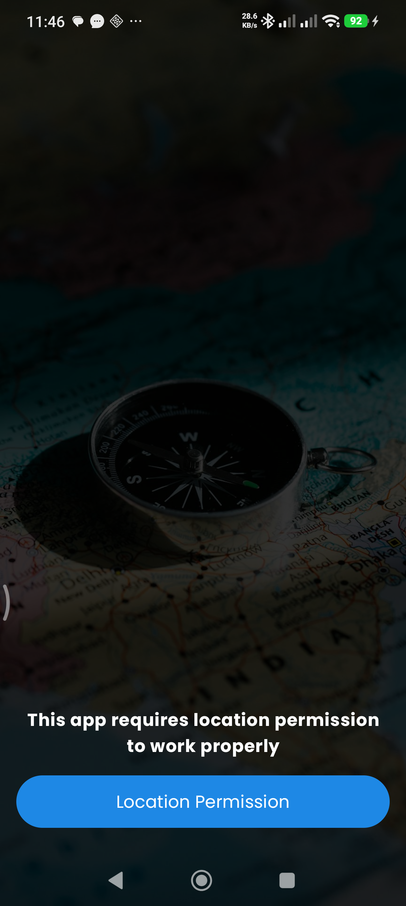
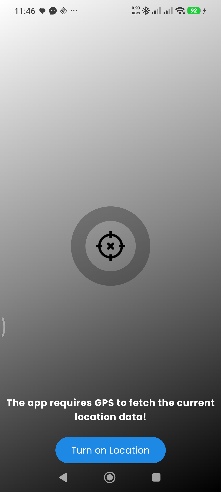
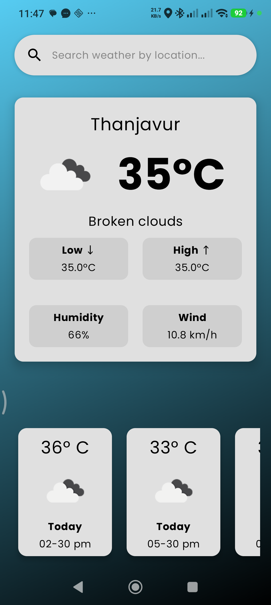

# demo_readme

<div align="center">

<!-- BANNER / LOGO -->


<br/>
<br/>

<!-- BADGES -->


<br/>

### 🚀 *One-liner that captures what your app does and why it matters.*

[**Download APK**](#installation) · [**View Demo**](#demo) · [**Report Bug**](../../issues) · [**Request Feature**](../../issues)

</div>

---

## 📋 Table of Contents

- [About](#-about)
- [Demo](#-demo)
- [Features](#-features)
- [Tech Stack](#-tech-stack)
- [Installation](#-installation)
- [Roadmap](#-roadmap)

---

## 🧭 About

> **Local Weather** is an Android application built with Kotlin and Jetpack Compose that fetches local weather data through openweatherapi. It requires GPS to properly fetch your current location data(at the moment + forecast for the next 7 days), and also you can check the weather of a specific place you wish to know(weather at the moment only). On App relaunch it would check the permission and then if the GPS is enabled or not and proceed to home screen.

Whether you're [target user A] or [target user B], **YourAppName** gives you [core value proposition] — right from your Android device.

---

## 🎬 Demo

<div align="center">

| Permission | GPS Check | Home |
|:-----------:|:--------------:|:--------:|
|  |  |  |

</div>

> 💡 *Replace the placeholders above with actual screenshots. You can drag images into your repo's `/assets` folder and reference them here.*

---

## ✨ Features

| Feature | Description |
|---|---|
| ⚡ **Feature One** | Brief description of this feature and its user benefit |
| 🎨 **Feature Two** | Brief description of this feature and its user benefit |
| 🔒 **Feature Three** | Brief description of this feature and its user benefit |
| 📊 **Feature Four** | Brief description of this feature and its user benefit |
| 🔔 **Feature Five** | Brief description of this feature and its user benefit |
| 🌙 **Dark Mode** | Full dark/light theme support via Material You theming |
| 📱 **Offline First** | Core functionality available without internet connection |

---

## 🛠 Tech Stack

<div align="center">

| Layer | Technology |
|---|---|
| **Language** |  |
| **UI** |  |
| **Architecture** | `MVVM` + `Clean Architecture` |
| **DI** |  |
| **Async** |  + `Flow` |
| **Networking** |  + `OkHttp` |
| **Local DB** |  |
| **Navigation** | `Compose Navigation` |
| **Testing** | `JUnit4` + `Espresso` + `Compose UI Tests` |
| **Build** |  with `Version Catalogs` |

</div>

> ✏️ *Remove rows that don't apply and add any libraries specific to your project.*

---

## 📦 Installation

### Prerequisites

- Android Studio **Hedgehog** (2023.1.1) or newer
- JDK **17**
- Android SDK with **API Level 24+**
- A device or emulator running **Android 7.0 (Nougat)** or above

### Clone & Build

```bash
# 1. Clone the repository
git clone https://github.com/your-username/your-app-name.git

# 2. Navigate to the project directory
cd your-app-name

# 3. Open in Android Studio
# File → Open → select the project folder
```

```bash
# Or build directly from command line
./gradlew assembleDebug
```

### Download APK

| Version | Date | Download |
|---|---|---|
| `v1.0.0` | Coming soon | [](../../releases) |

---

## 🗺 Roadmap

```
v1.0.0  ████████████████████  ✅  Initial release
v1.1.0  ████████░░░░░░░░░░░░  🔧  [ ] Feature A  [ ] Bug fix B
v1.2.0  ░░░░░░░░░░░░░░░░░░░░  📌  [ ] Feature C  [ ] Feature D
v2.0.0  ░░░░░░░░░░░░░░░░░░░░  💡  [ ] Major redesign / new module
```

- [x] Project scaffolding and architecture setup
- [x] Core UI with Jetpack Compose
- [ ] Feature A — *in progress*
- [ ] Feature B
- [ ] Feature C
- [ ] Widget support
- [ ] Tablet / large screen optimization

> Have an idea? [Open a feature request](../../issues/new) — contributions are welcome!

---

## 📄 License

```
MIT License

Copyright (c) 2026 Your Name

Permission is hereby granted, free of charge, to any person obtaining a copy
of this software and associated documentation files (the "Software"), to deal
in the Software without restriction, including without limitation the rights
to use, copy, modify, merge, publish, distribute, sublicense, and/or sell
copies of the Software.
```

---

<div align="center">

Made with ❤️ using **Kotlin** & **Jetpack Compose**

⭐ If this project helped you, consider giving it a star!

</div>
